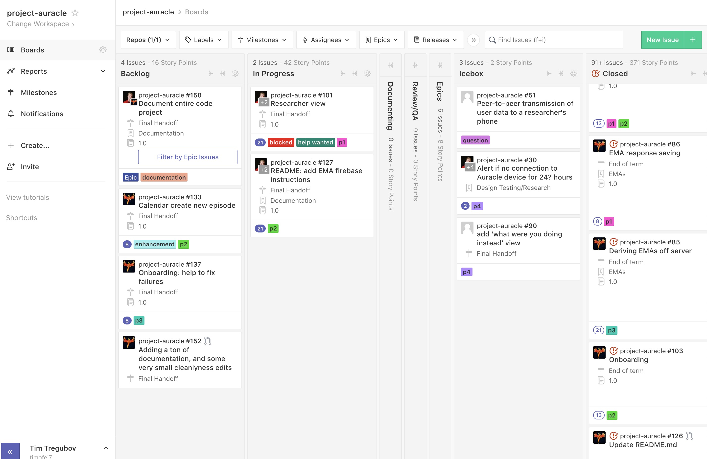
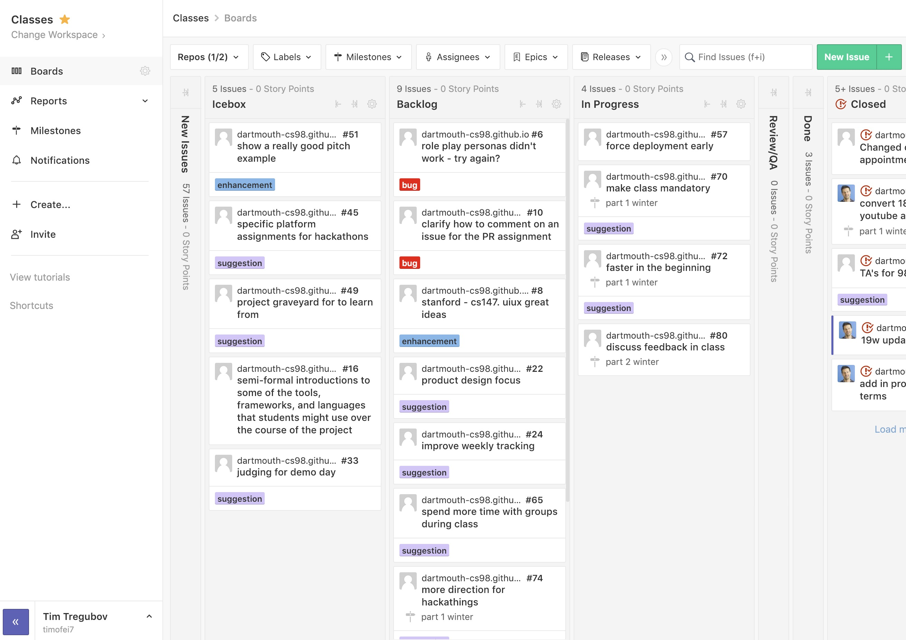

{: .fancy .medium-small}

This is the time to plan out your milestones for this term. We will do fewer pre-assigned milestones but will instead focus on custom milestones for your individual projects.

As you think about your milestones, consider any feedback you collected and carefully prioritize your features. You have 9 weeks to turn your current beta MVP into a polished, fully working, and shipped final product!  Think about your critical features and accommodate them first.  Make sure your user flow works and makes sense.  At week 5 we will have midterm presentations so that will be another chance for you to get more feedback and iterate and refine further. So the next working iteration of the product should be ready for week 5.

## ZenHub! 

<iframe class="fancy" src="https://player.vimeo.com/video/207024351" width="640" height="351" frameborder="0" webkitallowfullscreen mozallowfullscreen allowfullscreen></iframe>

This term we're introducing [ZenHub](https://www.zenhub.com/) to help us manage our issues and code sprints.

GitHub issues have been great, but they are hard to keep track of when you have a lot (just a long list) and it is hard to know who is currently working on what, or to assign due dates to things.  Milestones within GitHub are ok, but also not great.  ZenHub fixes all of this, and is powered by GitHub issues underneath it all, so you can still connect/[close them with Pull Requests](https://blog.github.com/2013-05-14-closing-issues-via-pull-requests/) as usual. 

{: .fancy .medium}
 *(a well utilized DALI ZenHub board)*

There are two different ways to use ZenHub - you can either download a [Chrome Extension](https://www.zenhub.com/extension) and then ZenHub appears in the GitHub interface for you automagically. Or you can log in via [zenhub.com](https://app.zenhub.com) - just log in via github, choose **dartmouth-cs98** as your Organization,  change workspace to one of your repos.  It should already be set up that there is a workspace named for your project that is connected to all of your repos.  This means that all your issues show up (under *New Issues*). 

### Features of ZenHub:

{: .fancy .medium}
 *(release velocity planning in ZenHub)*

* **cohesive**: all your issues from multiple repos appear in 1 workspace
* **pipeline**:  assignements are different from what is currently being worked on - move an issue to *In Progress* when you are working on it. Feel free to claim or assign others to issues. More on pipelines below. 
* **duedates / milestones**: to assign a date to a group of issues you can create a *Milestone*. Milestones should be thought of as sprints,  sets of tasks with a common due date.  Makes sense to have them similar to milestone due dates.
* **epics**: You can also use *Epics* to group sets of smaller tasks.  If a single issue seems too big - *convert to epic*.
* **reports**: One you have milestones you can see an estimate of how quickly you'll finish all your tasks.
* **dependencies**: You can make issues dependent on other issues, so if you have a task that requires someone else to do something you can mark that so they know they are blocking you. Very helpful!

### [Default Pipeline Breakdown](https://help.zenhub.com/support/solutions/articles/43000010339-setting-up-your-first-zenhub-workspace): 

{: .fancy .medium}
 *(starting to use ZenHub for class feedback)*

* **New Issues**: 
    New Issues land here automatically. You should drag (triage) them out of here as soon as possible.

* **Icebox**: 
    The Icebox represents items that are a low priority in the product backlog. Leaving Issues in the icebox over deleting them helps avoid a cycle of raising duplicate Issues. Icebox Issues should not take up a team member's time or mental bandwidth; putting ideas into the Icebox Pipeline gets them out of the way and helps teams focus on immediate priorities.

* **Backlog**: 
    Backlog Issues are not a current focus, but you will act on them at some point. If they don't have a GitHub Milestone, you can consider them part of your “product backlog”. Once you add a Milestone, they become part of your “sprint backlog” (that is, the tasks that you'll complete in an upcoming sprint.) The process of keeping this pipeline organized is known as “backlog refinement”.

* **In Progress**: 
     Issues here should have a good amount of detail, like estimates and requirements, since they're your team's current focus. This is the answer to, “What are you doing now?” Ideally, each team member should be working on just one thing at a time. Tasks here should be ordered by priority with Assignees added.

* **Review/QA**: 
    Use the Review/QA column for Issues that are open to the team for review and testing. Usually this means the code is ready to be deployed, or already is in a Staging environment.

* **Done Issues**: 
    in this pipeline need no further work and are ready to be closed. Having a good ‘Definition of Done’ agreed upon before work starts on an Issue is very helpful here! If there were any objectives or key metrics associated with the Issue, they can be appended prior to closing.

## Apply It

1. 🚀Go through **ALL** your current *New Issues* and deal with them.
    * Either sort them into *Icebox* if you aren't going to work on them soon.
    * *Backlog* if they are something to work on next.
    * *InProgress* for the specific tasks you are currently going to work on.
    * Close issues that are old or deprecated. 
1. 🚀Enter in **ALL** bugs from the past term.
    * create new issues (select the appropriate repo "Create in ..." if associated with a particular repo).
    * label them with a 🐛bug label
    * you can break them down further with:
        * [ 🔥 blocker]
        * [ ❗️important]
        * [ 🍲 back burner]
        * [ 🙅won't fix]
1. 🚀Enter in **ALL** new feature ideas
    * create new issues (select the approriate repo "Create in ..." if associated with a particular repo) for each new feature idea you had via feedback last term, or as you brainstormed earlier in this milestone.
    * label them with a  💎enhancement tag or others as you see fit. Feel free to use invalid. Or create your own tags.
1. 🚀Create a milestone:
    * create a new milestone and label it "week 1 sprint" with a due date of 1/10/2019.
    * take at least 2 tasks/bugs per person that you want to finish first and assign them to this milestone.
    * now you'll be able to track progress toward the milestone!  and get graded on it! 🏄

**More about good agile workflow [here](https://help.zenhub.com/support/solutions/articles/43000010338-agile-concepts-in-github-and-zenhub).**

## Scope and Assignment

Remember that each issue should be scoped to be around 1 sitdown work session, just a couple hours. Break up large tasks into individual smaller ones, each one should be under a few hours of work. The smaller the tasks the actually faster you will work (not just the appearance of speed).  It is easier to take on a manageable scope issue and work through it than if the issue has multiple steps that quickly become overwhelming to think through. 

💢Feel free to assign each other tasks, a little aggressiveness is ok! you can interact via comments on the issues also, on a good project the board will feel like a community, people upvoting and clapping for each other, discussing the issues, or how best to implement something. EC: mention @timofei7 or @ksalesin in an issue or a PR when you need help or feedback or want to say hi. We're happy to help — and since this was a wall of text we'll know that you happened to read it all. 

## Motivation 

🚂 Consistency in using a task manager style tool is hard. But here's the motivation — this is a very common approach — and in our case we'll also be using issue engagment and closure (together with PRs/commits) as grade metrics.  But at least we won't be doing [stack ranking](https://www.businessinsider.com/stack-ranking-employees-is-a-bad-idea-2013-11)! 😑

## To Turn In:
* do all the steps in the [ZenHub section](#apply-it), don't forget to label as we'll be checking for those.
* submit zenhub link to your workspace with a filter set
* work on and close some issues, if you have some time, complete your first milestone. Let's front load this term and get a lot done in the next couple of weeks. Submit links to any closed issues.
