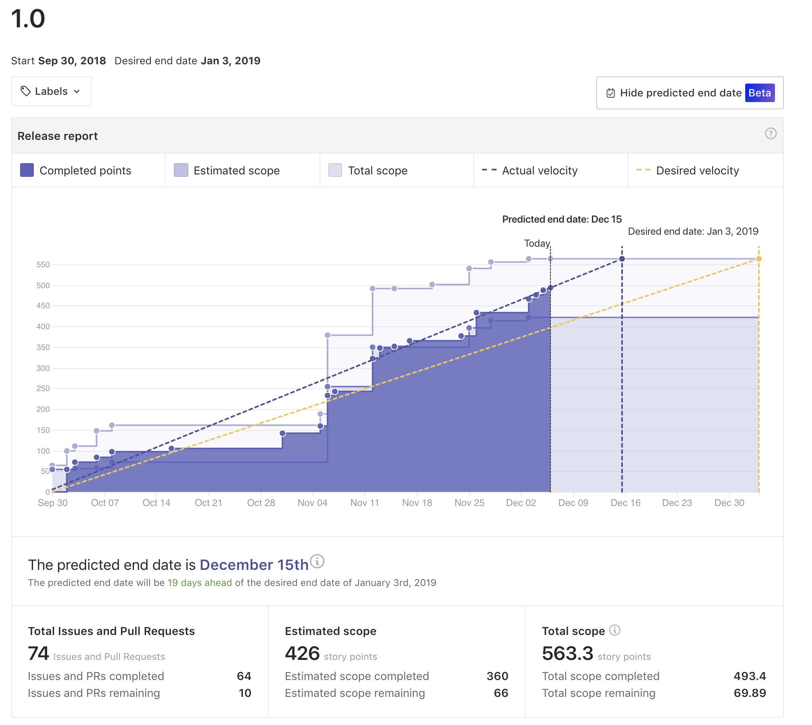

This is the time to make some plans for this term. We will do fewer pre-assigned milestones but will instead focus on individual sprints and features for the projects.

As you think about your features, consider any feedback you collected and carefully prioritize your features. You have 9 weeks to turn your current MVP into a polished, fully working, and shipped final product!  Think about your critical features and accommodate them first.  Make sure your user flow works and makes sense. 

As you think ahead, you should know that this term is fast paced. You should have an alpha release ready by midterms and a beta release two weeks after that. For any consumer facing product you'll want to get it into the hands of real users by week 7 or so. That last step is hard, polishing a thing and shipping it, you think you can save it for last, but you don't want to be that group that is pulling an all-nighter before final demos. Ideally, no all-nighters should be required! 🌃

## Tag in Master (for the end of the week)

At the end of the week, when you are closing out your sprint, you should tag a working version of your repos. Merge working features that you are closing into your `master` branch (if you have a different naming scheme let us know),  make sure that each repo is in a **buildable** state (compiler checks pass, the project can be run). Then apply a tag with the name of the sprint you are closing.  `t2.sprint1` is what you'll use at the end of this week. This is the version we'll be looking at each week.

### Using git tags

```bash
#make sure you are in your master branch
git diff #make sure you are all committed and pushed
git tag t2.sprint1 #this will tag the current place you are at as t2.sprint1
git push origin --tags
```


## ZenHub Refresher! 

{: .fancy .medium}
<br>*(release velocity planning in ZenHub)*

Remember our pal ZenHub?  We're mostly just going to keep doing sprints all term! So pretty much the same.  

The biggest reason that we're using ZenHub is because it is backed by github issues. If you prefer simply using github issues during your day to day, you can.  The reason we don't use some other work/issue management system such as Asana, etc, is mostly because they are more complicated and don't integrate with GitHub as nicely. However, they are all pretty much identical in features. If you are worried about industry standards, the way we are using ZenHub is pretty similar to how people use Asana/Jira/Basecamp etc. The backlog-icebox-inprogress-review-done task workflow is fairly standard. 

## New Term - New Issues

1. 🚀Go through **ALL** your current *New Issues* and deal with them.
    * Either sort them into *Icebox* if you aren't going to work on them soon.
    * *Backlog* if they are something to work on next.
    * *InProgress* for the specific tasks you are currently going to work on.
    * Close issues that are old or deprecated. 
1. 🚀Enter in **ALL** bugs from the past term.
    * create new issues (select the appropriate repo "Create in ..." if associated with a particular repo).
    * label them with a <span style="color: red;">🐛bug</span> label
    * you can break them down further with:
        * <font style="color:red">[ 🔥 blocker]</font>
        * <font style="color:orange">[ ❗️important]</font>
        * <font style="color:lightblue">[ 🍲 back burner]</font>
        * <font style="color:grey">[ 🙅won't fix]</font>
1. 🚀Enter in **ALL** new feature ideas as **Epics**
    * create new issues (select the appropriate repo "Create in ..." if associated with a particular repo) for each new feature idea you had via feedback last term, or as you brainstormed earlier in this milestone.
    * label them with a <span style="color: blue;"> 💎enhancement</span> tag or <span style="color: orange;">🚔critical</span> or others as you see fit. Feel free to use `invalid` and/or create your own tags.
1. 🚀Create a milestone:
    * create a new milestone and label it `term2 week1 sprint` with a due date of next Sunday. **always add due dates to sprints**
    * assign some tasks, the usual 4 per. 

## Scope and Assignment

Remember that each issue/task should be scoped to be around 1 sitdown work session, just a couple hours. Break up large tasks into individual smaller ones, each one should be under a few hours of work. The smaller the tasks the actually faster you will work (not just the appearance of speed).  It is easier to take on a manageable scope issue and work through it than if the issue has multiple steps that quickly become overwhelming to think through.

💢Feel free to assign each other tasks, a little aggressiveness is ok! you can interact via comments on the issues also, on a good project the board will feel like a community, people upvoting and clapping for each other, discussing the issues, or how best to implement something. EC: mention `@timofei7` in an issue or a PR when you need help or feedback or want to say hi. We're happy to help — and since this was a wall of text we'll know that you happened to read it all. 

## Start of Week Checkins

Every week, after your sprint transition, we'll do a checkin in class specific to what you what you worked on. You should be prepared to show progress and we're review your transition and help scope out next steps if you need.


## To Turn In:
* do all the steps and get your zenhub boards in order.
* submit zenhub link to your workspace with a filter set
* work on and close some issues. Let's front load this term and get a lot done in the next couple of weeks.
