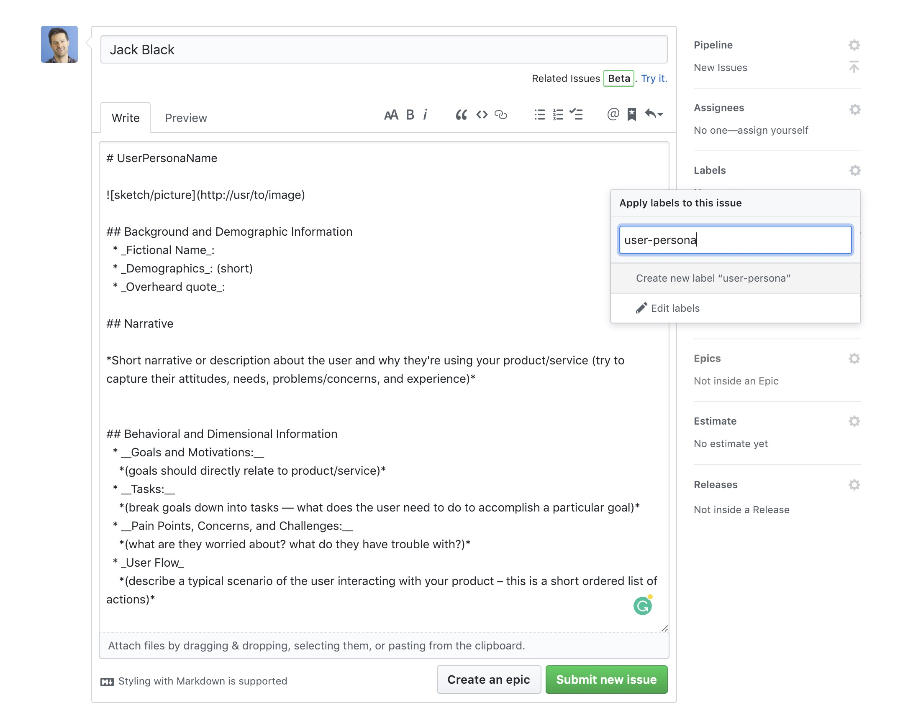

{: .medium_small}

## Stakeholders

Before we dive deeper into what we are building, we should talk about who the stakeholders are.  

Stakeholders are anybody who gives a damn about what you are building. These can be your end users, founding team, investors, clients, customers, parents, and professor.  Regardless of what you are building, there are most likely humans involved. Actually, stakeholders can also be non-humans in the case where you are building something for animals or aliens. Regardless, identifying who they are and what they want will help you figure out what to build.


## Feature list

At some point soon, you'll need a list of features that you will work off of. To get to this list of features — we're going to first make up some users. Their needs and desires will drive our features — so they need to exist first. *Expecto Patronum.*

## User Stories and Personas

User stories are short scenarios about how your product is used.  User personas are the fictional individuals who comprise your product's users.  Your personas should have names and believable backgrounds.  They should have specific demonstrated use cases for your product.  You will refer to them as you work on the product and you'll find they will be quite useful!  The aim of user stories is to codify specific use cases for your product and allow them to be easily communicated as you build the product.  They help keep the team focused on the functionality of the product for specific people rather than getting sidetracked by features that seem "cool" or "look good".  For every feature in your spec you should have a user persona that would find it useful or compelling.

We'll store our Personas as [Issues in our github repos](https://help.github.com/articles/creating-an-issue/). We'll dig into that more later but for now - go to your main repo. 

🚀 Create a new issue for each persona you come up with.



__Structure your user persona like so:__

```markdown
# UserPersonaNickName


## Background and Demographic Information
  * _Nickname_: (forget real names, pick a caricature nickname that is memorable)
  * _Demographics_: (relates to your target audience)
  * _Overheard quote_: (a complaint or use case of why this product is for them)

## Narrative

*Short narrative or description about the user and why they're using your product/service (try to capture their attitudes, needs, problems/concerns, and experience)*

 
## Behavioral and Dimensional Information
  * __Goals and Motivations:__
    *(goals should directly relate to product/service,*
    *what are they trying to accomplish)*
  * __Tasks:__
    *(break goals down into tasks — what does the user need to do to accomplish a particular goal)*
  * __Pain Points, Concerns, and Challenges:__
    *(what are they worried about? what do they have trouble with?)*
  * __User Flow__
    *(describe a typical scenario of the user interacting with your product – this is a short ordered list of actions)*
```


Once you have the user personas they will help a great deal in figuring out your essential features and thinking more deeply about what you are building. Later you will pull out critical features from the personas to populate our take on a feature spec (really just a list of critical features that comprise your product).


## Channel a Persona

You should create 1 per member on your team. 

For each persona you create as a separate issue in github assign 1 teammember.  From now on you will channel that persona — in conversations about your product you will be responsible for remembering their needs and championing their usage of the product.  This is a live document and you can update it as you go along.

{: .medium}


## To Turn In:

* GitHub URLS for each user persona created. 