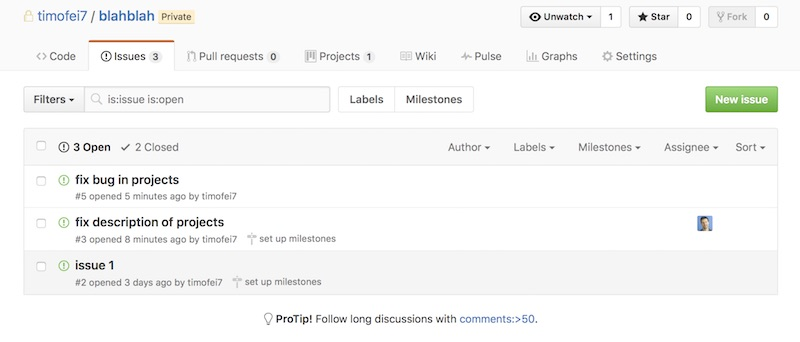

{: .fancy .small}

At this stage you should have rudimentary functionality in place. For instance if you were building a web or mobile app there should be frontend components hitting api endpoints that are pulling data from the database. You should have all the components/views planned out and started in code even if they are simple placeholders. You should be at the point where you have some of your presentational components (UI) laid out and have started on wiring things together with any data sources such as your api server (or computational/algorithmic logic depending on your project).

## Implementation and Wiring

For this milestone the main idea is to get a "deep" wiring of your project components.  If you have a frontend and backend, make sure they can talk to each other.  If you have computational elements and display elements, this is the time to move past mockup data and have the display use the computed data.  You don't have to have every data connection wired up, but at least one should be working - the idea being to test the full data path.

## GitHub Issues

{: .fancy .large}

It's time to maximize our usage of github by using some project management features in addition to your current git flow of feature branches and pull requests.

❓ When should you use GitHub issues? 
✅ ALWAYS!

❓ What is the right scope for an issue? 
✅ You can think of issues as individual tasks: "create login button",  "api endpoint for user profile", etc.  Issues can also be bugs that you find along the way.  Break up large tasks into individual smaller ones, each one should be under a few hours of work.  The smaller the tasks the actually faster you will work (not just the appearance of speed). It is easier to take on a manageable scope issue and work through it than if the issue has multiple steps that quickly become overwhelming to think through.

❓ Should I assign my teammates to issues? 
✅ Yes! You should assign people to each issue as you work on them so your team knows who is doing what. Feel free to assign each other tasks, a little aggressiveness is ok!  

 

{: .fancy .small}

🚀 Remember a part of your grade is usage of issues - once your project gets rolling you should shoot for closing 5 issues per week per person.  This should give you a sense of the scope of an issue. If each issue is under 2 hrs then 5 issues is around 10 hours.  This isn't a hard and fast rule - but try to do this on average. 

## README.md

Make sure your README.md files are updated with the current installation and deployment instructions as well as any architecture changes.

## Continuous Integration / Testing (optional/extra credit)

You could set up Travis CI for your project with automatic linting / build checking. If you are writing for the web - set up your project with eslint.   Whenever you push to github it will automatically run eslint. There are automatic build runners for most languages. This is optional but can be helpful - especially linting.  You can have Travis CI run other stuff/tests. For web here's a small howto on how to set up [Travis](http://cs52.me/resources/travis).

## To Turn In:
* short description (couple of sentences) of what worked and what didn't.
* make sure everyone on your team has been assigned at least 2 issues and has marked at least 1 issue as done.
* turn in links to each assigned issue
