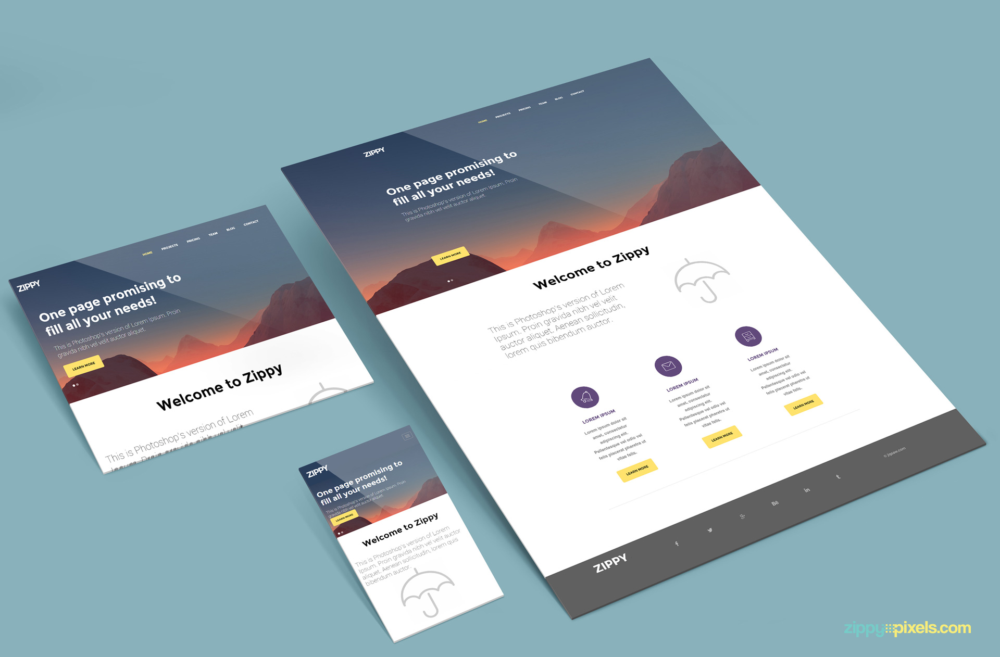
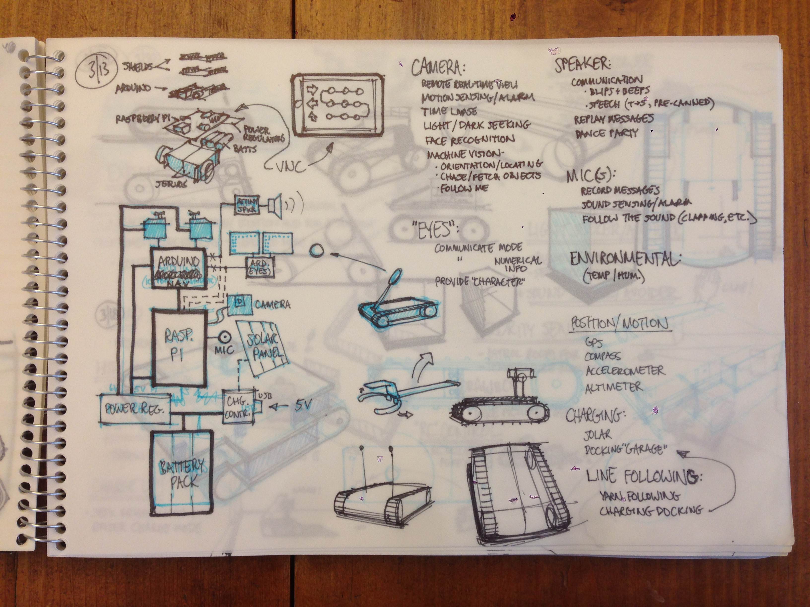
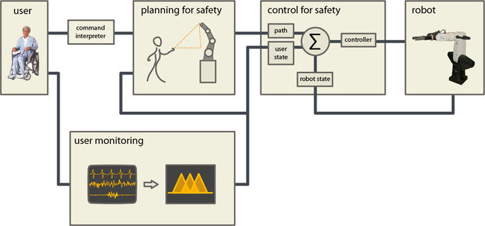
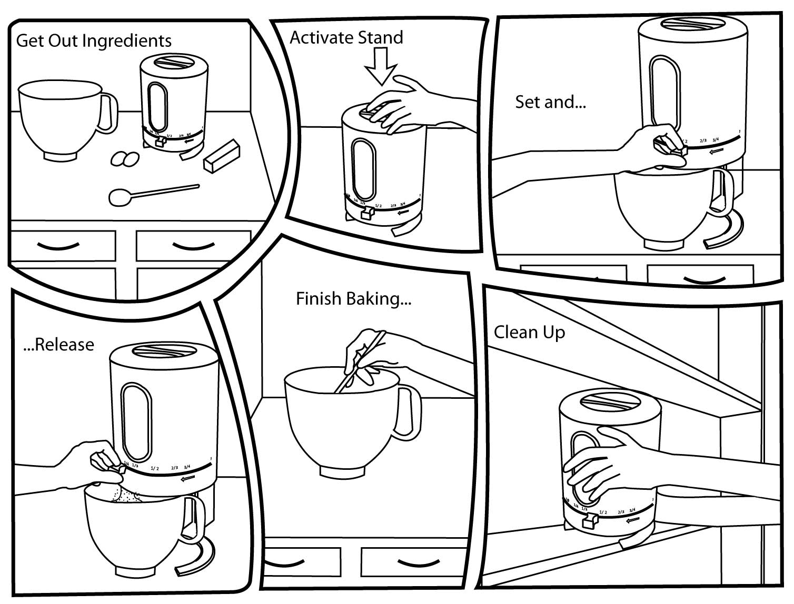
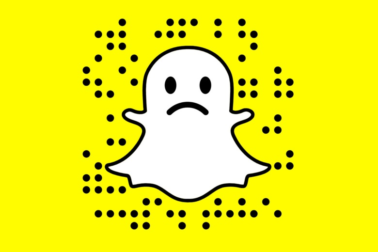
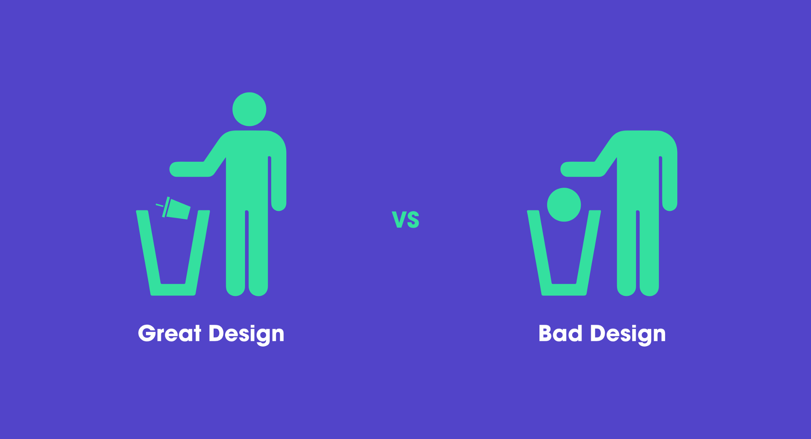

layout: true
class: center, middle
name: pic
background-size: contain

---

layout: true
class: center, top
name: fragment

.title[{{name}}]

---
layout: true
class: center, middle
name: base

.title[{{name}}]

---
name: Design

.fancy.medium[]

???
* just some tips
* not really a designer (tried to go to graphic design school many years ago though)
* here's what I've learned from hanging around designers
* based on working on hundreds of projects
* similar to my spiel to cs52

---
name: But I just want to code!!

.fancy.small[]

🚫

???
* cowhand coding - just leads to manure code
* just jumping in will lead to having a big ol mess of features
* stuff you don't even need to build
* i'm happy to help
* also office hours / open lab hours in DALI have many designers happy to help
* doesn't hurt to learn

---
name: Step 1: Inspiration Board

* find examples of similar products
* take screenshots
* save urls
* copy color schemes

.fancy.medium[]

???
* other people have made pretty designs,  look at them, use them for inspiration, copy them as best you can
* you've all been keeping these already right?   
* inspiration boards are the biggest difference between good designers and pretenders.  if a designer starts with an inspiration board you can see their thought process and it is obvious in the final product that they thought about what they were making

---
name: Step 2: Sketches

* paper is best
* quickly jot down views and functionalities

<iframe src="//giphy.com/embed/d26EH3VCAHS12?hideSocial=true" width="380" height="284" frameBorder="0" class="giphy-embed" allowFullScreen></iframe>

???
* make them on paper first
* much faster
* we'll try to get to that today

---
name: Step 3: Mockups

* with inspiration and sketches
* start on mockups ([figma](http://figma.com), [sketch](https://www.sketchapp.com), etc)
* don't code them yet

.fancy.medium[]

???
* the case for mockups:
* help you remember what needs to be built
* much quicker to play around with different options quickly and easily to determine what works best for your product
* coordinate with your team - keep everybody on track

---
name: No UI? No problem!

.fancy.small[]

.fancy.medium[]

???
* Some products may not have what you would think of as a traditional user interface
* maybe it is a code library,  or a physical device that has certain behaviors.  
* However, these still have a user facing aspect
* map out your public API - function calls or http endpoints are your user interface
* physical device with certain behaviors - map out what those are and what is the control interface
*  Additionally, you can use this opportunity to design any materials that communicate what your device does to the outside world.

---
name: Step 4: Functional Mockups

* put mockups together
* built in to Figma or
* Invision: https://www.invisionapp.com/education-signup
* PopPaper: https://marvelapp.com/pop/

.fancy.medium[]

???
* great way to test your interactions
* woop forgot some logic path from one view to another
* can run it by users and see if they can figure it out
* again for the AR or robot projects

---
name: No UI? No Problem, p2

.fancy.medium[]

* storyboard

???
* you can storyboard out the interactions and behaviors
* in some cases like AR you probably want to do both!

---
name: Colors

* Not just random
* Use a color scheme chooser: [color.adobe.com](http://color.adobe.com)
* Steal from other sites

.fancy.medium[]

???
* picking colors
* beg, borrow, steal color schemes

---
name: Hierarchy

* visual hierarchy
* what users see first, order of gaze
* visual saliency

.fancy.medium[]

???

* laying out your page, remember to think about the visual hierarchy
* ordering of what users see based on size/color/movement
* What will users eyes see first, your call to action, or the large user profile button that they never really need to go to
* Try to imagine what you would notice first as a new user and then order your elements in terms of visual saliency appropriately
* Larger and brighter colored things tend to be noticed first
* Positioning also matters, we tend to look at things in a [letter F pattern](https://uxplanet.org/f-shaped-pattern-for-reading-content-80af79cd3394).

---
name: More Principles

.fancy.medium[]

* [more principles](http://blog.visme.co/visual-hierarchy/)

???
* pretty good read with lots of examples
* recommend at least some people on the team get excited about design
* is important - makes or breaks a project

---
name: Mindfulness

.fancy.medium[]

UX is like a joke...

???
* famous designer
* every choice you make conveys something
* you chose blue for a restaurant site because you like blue
* but blue is not appetizing, doesn't make people feel hungry - RED does weird.
* think about and defend every choice you make - 'i just like it' doesn't cut it.
* hidden interaction like swiping or hamburger - be careful.
* ux is like a joke - its bad if it needs explaining
* can use this time to test that!

---
name: Make or Break

.fancy.medium[]

* [drop in users](https://techcrunch.com/2018/05/01/snapchat-reredesign/)

???
* i always found the hidden slides to be confusing but changing things once people get used to it is even worse
* just announced snapchat originals or some such bullshit to lure back lost users

---
name: resources

.fancy.medium[]

lots of resources out there

* [cs52.me/workshops/design](http://cs52.me/workshops/design)
* https://dribbble.com/
* https://blog.prototypr.io/design-for-programmers-d38c56982cd0
* http://www.cssdesignawards.com/
* https://www.awwwards.com/web-design-trends-for-2017.html

???
* best form of flattery is imitation

---
name: NEXT Scaffolding

 .fancy.medium[]

* initial code scaffolding
* tools and frameworks chosen
* team has local dev environment set up

???
* Next Thursday
* Initial code scaffolding started
* component plan
* tools and frameworks chosen
* everybody has local dev environment set up

---
name: NEXT Scaffolding

.fancy.small[]

???
* work together and don't skimp on just winging it
* don't want this to happen - hurricane is coming
* we'll work on it next week but wanted to release it so maybe some people on the team can start on it early

---
name:  Sketch Time Step 1: Generate Options

.fancy.medium[]

* which **(2-5) main features** you will sketch that are essential to your product
* thick markers, paper
* **5 minutes of individual sketching per feature**
* compare sketches and create group versions
* Aim for **2-3 versions per feature**.

???
* Use the “thick marker trick” - the thicker the marker, the more you force yourself to keep the designs at a conceptual level (it’s difficult to add in details when the marker tip is so large!). Whiteboard markers are great here too, just take photos!
* Include little or no specific content
* Drop any worries about scale, straight lines, grids, etc.
* Think in flows whenever possible (what pages come after?)
* Match your sketches with your flow diagram - what part of the flow is not yet in the sketch?
* Never settle for your first idea!

---
name:  Sketch Time Step 2

.fancy.medium.left[]

* Put in [Pop Paper](https://marvelapp.com/pop/)
* Test User Flow
* Test as your persona with buddy team!  
