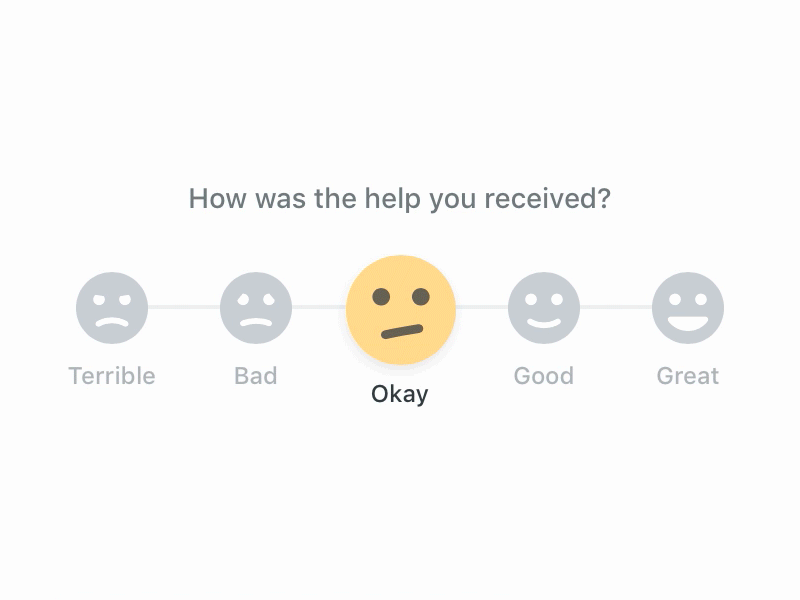
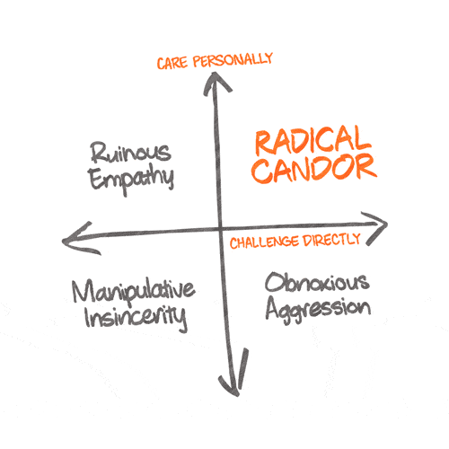
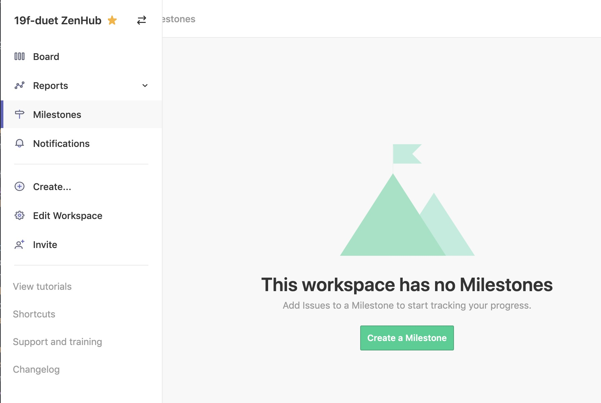
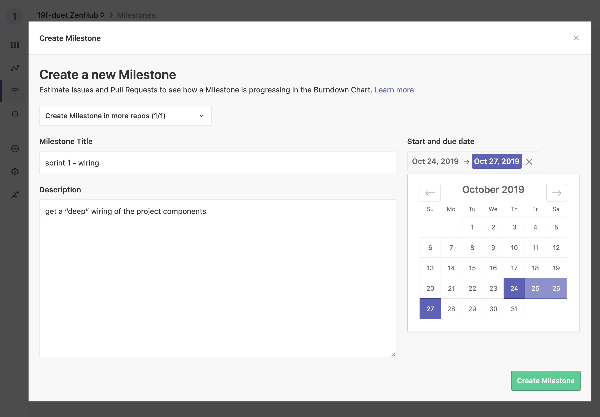

layout: true
class: center, middle
name: pic
background-size: contain

---

layout: true
class: center, top
name: fragment

.title[{{name}}]

---
layout: true
class: center, middle
name: base

.title[{{name}}]

---
name: Design Feedback

.fancy.medium[]

---
name: Design Feedback

.fancy.medium_small[]

???
*

---
name: Heart

.fancy.medium_small[]

???
* the biggest success predictor is caring
* if you care - then you think about the project
* if you care - then you are mentally engaged
* if you care - then you can change the world

---
name: Empathize

.fancy.small[]

???
* empathy with the user persona

---
name: Keep users in mind

.fancy.medium_small[]

* ask for and give project brief
* share user personas and who the target audience is
* act the part
* empathize
* get into it

???
*

---
name: Pretend

.fancy.medium[]

???
* also - think onboarding flow
* when you try out someones figma (or product) do you get it right away?  be a critical thinker - question assumptions even if you got a good verbal intro into the project - does it make sense to you?

---
name: Feedback Partners

.fancy.medium_small[]

* sit with feedback partner (someone on another team)
* give a brief overview of problem statement
* introduce and show some of your user personas
* open figma project on commenters computer
* commenter plays with project and records feedback
* discuss as you go
* then switch

???
* is graded - want to see comments from each of you :-) 
* we'll do for first 45 min or so then you can work on scaffolding etc
* please put your heart into helping your feedback partner / discussion
* you are also welcome to get some feedback on your scaffolding plan with them if you want or your idea or your user persona - they can create a github issue instead we should all have access to each others repos

---
name: Planning our first sprint

.fancy.small[]

* Sprint retrospectives are due every Sunday night (2AM Monday)
* Idea for this first one is to connect your components (client <-> server <-> db)

???
*

---
name: Create a Milestone

.fancy.left[]
.fancy.right[]

???
* milestones are by time - weeks
* epics are by subject - features

---
name: Rake Your ZenHub Garden 🌻

1. **Create a new sprint milestone**
1. **New Bugs**
1. **Enter Feedback**
1. **Update Epics**
1. **New Subtasks**
    * create new issues
    * label them
    * assign a time estimate
1.  **Process All Issues**
    * *Icebox*
    * *Backlog* 
    * *In Progress*
    * no unsorted *New Issues*.
    * update time estimates
1. **Assign Subtasks**

???
* i know there's a lot of text in the milestone... but its not rockets science - you just have to maintain a current sprint and issues that are sorted
* as the week goes you can add issues into the new issues pile and wait until the retrospective to sort them out
* each subtask is one code session or thereabouts
* using milestones will give you a way to group your weekly tasks even when the are just parts of epics - remember epics are for long feature - milestones group tasks by week - so you can see the progress you are making 

