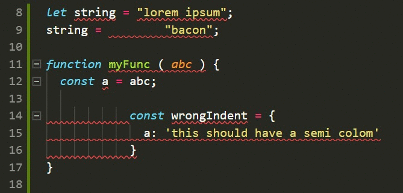
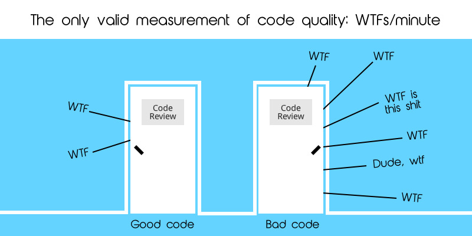
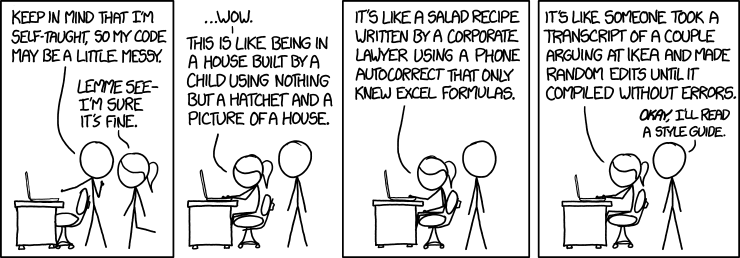
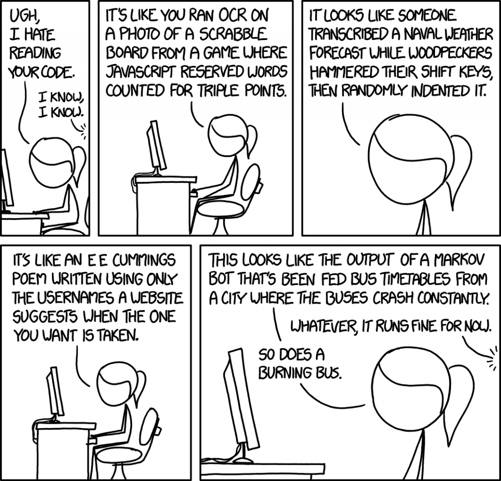
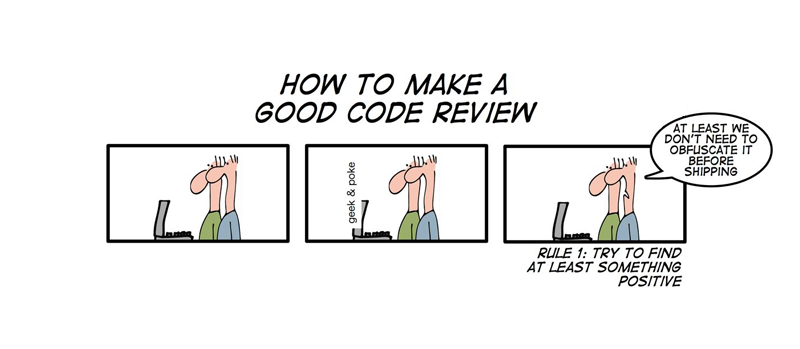
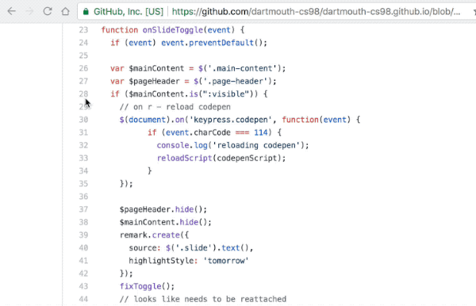

layout: true
class: center, middle
name: pic
background-size: contain

---

layout: true
class: center, top
name: fragment

.title[{{name}}]

---
layout: true
class: center, middle
name: base

.title[{{name}}]

---
name: CS98: Code Reviews

.fancy.medium[]
.fancy.medium[]

???
* gonna do buddy code reviews
* welcome to our guests - our star kevin, host bryan, and amy olsen media relations

---
name: Buddy Team Code Reviews

.fancy[]

???
* gonna do buddy code reviews
* who has had official code reviews at in internship or something?
* how did they go?
* what should a code review look like?
* or what would you want to get out of a code review?

---
name: Code Review Types

.fancy.medium[]

* in person walkthroughs / inspections
* pull request reviews (single / multiple)

???
* today we'll do in person walkthroughs
* they are more formal that just chatting
* less formal than inspections
* and a bit more civil than this one

---
name: How They Help?

.fancy.small[]

* *Code Complete* research:
    * design/code review: 60% *errors* caught
    * unit/function/integration: 25-45%
* "single biggest thing you can do to improve your code"
* "my code isn't done until I've gone over it with a fellow developer"
* learn from others

???
* jeff atwood - stackoverflow
* i enjoy them because it is a great chance to learn from others
* and be less embarrassed to show my work
* share your knowledge
* reading code as a way to learn

---
name: Walk through your code

.fancy.medium[]

* don't stress it - start high level
* brief demo of product
* then walk through frontend code (main views)
* then show server and any data models
* share what works and doesn't with current architecture

???
* consider it like onboarding a new person to the project
* what do you want them to know
* if your project is rul successful and you start hiring people

---
name: Ask questions

.fancy.medium[]

* how do you store that?
* did you consider?
* do you handle the case that?
* what is best practice?
* what does thaaat function do?

???
* if you see something say something

---
name: Things to look for?

.fancy.medium[]

* overall architecture clear?
* confusing code/logic
* best practices (linting, commenting, naming, consistency)

???
* architecture - microservices? data storage?
* do you understand how the components fit together?
* if you needed to change something would you know where / how?
* who knows what linting is?
* platitude: code that is easy to read is easy to debug
* what are some thoughts on what makes code easy to read?

---
name: Code Style?

.fancy.medium[]

* can be jarring but don't harp on it
* discussion is good, but not tabs vs spaces
* are they using a style guide?

???
* mechanical style issues, like tabs vs spaces, or basic naming rules for variables, shouldn’t even make it to the code review stage.
* missing linter?  yes
*  the best code reviews should provoke discussions (not tabs vs spaces)
* certainly interesting to ask if code style and why?

---
name: Error Handling?

.fancy.medium[]

???
* sometimes good - but don't go overboard on this just yet
* some clear cases, input checking for instance

---
name: Be Kind

.fancy.medium[]

* praise cool things
* learning opportunity for all
* if you like something say something

???
* i learn more from reading others code than they know

---
name:  Comment on GitHub

.fancy.medium[]

* make comments on the github
* at least 1 issue from each of you
* connect to a specific line or range of code
* can be a question - doesn't have to be an insightful criticism
* plz to engage with them afterwards

???
* 2 issues from each of you
* at least 1 must be on a specific line or range of code
* can be a question - doesn't have to be an insightful criticism.

---
name:  Example
exclude: true

* [boomsync2](https://github.com/timofei7/boomsync2)

???
* https://github.com/timofei7/boomsync2/blob/f5a0d7bb4413426d087a59b09a260499c8e1fb5a/src/App.js#L144  App.js has some amazing ternary stuff in it
* https://github.com/timofei7/boomsync2/blob/f5a0d7bb4413426d087a59b09a260499c8e1fb5a/src/Play.js#L259 Play.js inserts audio with autoplay when necessary  but also has a setTimeout that can't be cancelled

---
name:  Ok go!

.fancy.small[]

<!-- * https://canvas.dartmouth.edu/courses/29015/assignments/163454 -->

* get set up to project and decide how/who will show
* start with code walkthough
    * what is first code that executes
    * go from there through major components and logic
* each team has 30 minutes
* ask questions during walkthough
* ask to see specific things
* ask how they handle some specific case
* learn about architecture
* take notes and then go back and make issues

<!-- <iframe width="600" height="355" src="https://www.youtube.com/embed/u1ZB_rGFyeU?rel=0&amp;showinfo=0" frameborder="0" allow="autoplay; encrypted-media" allowfullscreen></iframe> -->

???
* since it is early the goal today is to get a sense of the architecture more than specifics of computations (unless that is already available)
* is helpful for the team too to make sure everybody is on the same page
